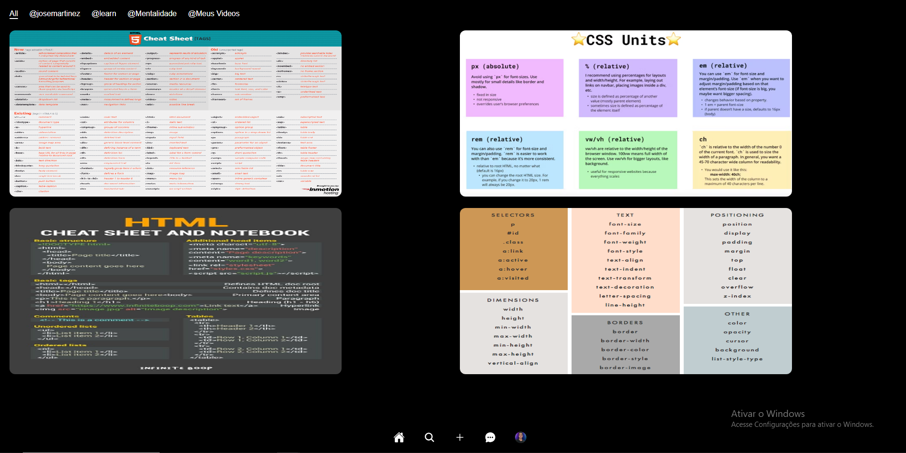

# Landing Page de Pinteres 

- Landing page feito na live da rocketseat Clonando o layout do pinteres onde falaram de fundamentos de programação e linguagen de marcação html e linguagem de estilos css 

> Landing Page de Pinteres 

## 🔗  Technologies

## 🔗 Contact

